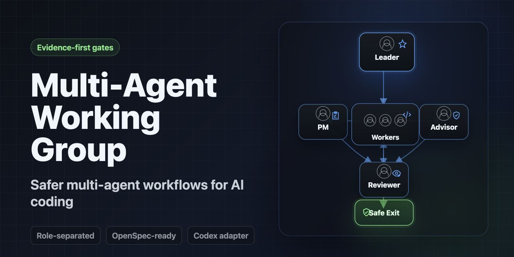

<h1 align="center">Multi-Agent Working Group</h1>

<p align="center">
  
</p>

<p align="center">
  <strong>Controlled multi-agent work for tasks where review, evidence, and safe exits matter more than speed.</strong>
</p>

<p align="center">
  <a href="#quick-start"></a>
  <a href="docs/RUNTIME_INSTALLATION.md"></a>
  <a href="docs/VALIDATION.md"></a>
  <a href="LICENSE"></a>
</p>

AI agents are fast, but fast work can blur who reviewed what, which evidence was
checked, and whether a commit, push, release, or handoff was actually
authorized.

Multi-Agent Working Group is a portable workflow protocol for AI-assisted work.
It gives careful tasks clear roles, independent review, durable evidence, and
explicit gates for validation, handoff, git, and release decisions.

Use it when you want agents to help with serious work without silently approving
their own output, losing context across conversations, or turning "looks done"
into "safe to ship."

This repository ships Codex as the reference packaged adapter. Claude Code
install guidance is available because it can consume a `SKILL.md` folder with
supporting files. Claude Code, OpenClaw, Hermes Agent, and other non-Codex
runtimes remain adapter guidance or compatible patterns until their adapters
are validated in real use.

| Without a working protocol | With Multi-Agent Working Group |
| --- | --- |
| Reviews, handoffs, and git exits depend on memory and chat history. | Leader, PM, Advisor, Worker, and Reviewer roles produce explicit evidence. |
| Agent output can look authoritative before it is checked. | Agent output is treated as evidence until the Leader verifies it. |
| Commit, push, release, and cleanup boundaries can blur together. | Local completion, normal git gates, and Owner-only exclusions stay separate. |

The skill is intentionally conservative. It keeps the Leader responsible for
orchestration and verification, treats agent output as evidence rather than
authority, and separates local completion, normal git gates, and Owner-only
exclusions.

> Current public version: `v0.4.18`, released on July 12, 2026 under `America/Los_Angeles` release-date semantics. No next development target is currently declared. Public release tags should point at reviewed commits; documentation alone is not a deployment claim. Version tracking lives in `README.md`, `CHANGELOG.md`, and release tags, while `agents/openai.yaml` remains versionless interface metadata.

## Quick Start

Use the protocol when a task benefits from independent critique, delegated work,
controlled commit or release gates, cross-conversation continuity, or a clear
record of what was checked before moving forward.

Codex reference-adapter minimal install:

```sh
git clone https://github.com/alexsglife-re/multi-agent-working-group.git
mkdir -p ~/.codex/skills/multi-agent-working-group
mkdir -p ~/.codex/skills/multi-agent-working-group/references
cp multi-agent-working-group/SKILL.md ~/.codex/skills/multi-agent-working-group/SKILL.md
cp -R multi-agent-working-group/references/. ~/.codex/skills/multi-agent-working-group/references/
```

Typical prompt:

```text
Use the multi-agent-working-group skill for this task.
```

For full checkout use, migration, validation, and scenario guidance, see
`docs/INSTALLATION.md`, `docs/RUNTIME_INSTALLATION.md`, and
`docs/ADOPTION.md`.

## Use Cases

Use Multi-Agent Working Group when you want to:

- coordinate PM, Advisor, Worker, and Reviewer roles during development;
- review whether an open-source repository is ready for promotion;
- improve the README first screen and quickstart path;
- draft release notes, Show HN posts, Reddit variants, LinkedIn posts, or X
  threads without publishing them automatically;
- create a staged launch or release-preparation plan;
- check whether public copy overstates runtime support, automation, safety, or
  maturity;
- run OpenSpec-backed work through C0 goal analysis, C1 proposal, C2
  implementation, C3 closeout, and C4 archive;
- preserve compact handoff evidence across long-running or spec-bound work;
- keep normal commit and push gates separate from Owner-only release,
  deployment, publication, force-push, destructive, secret, auth, and permission
  actions.

For scenario-specific adoption guidance, see `docs/ADOPTION.md`.

## Safety Boundaries

This protocol gives agents a workflow and evidence structure. It does not, by
itself:

- authorize commits, pushes, releases, tags, deployments, force-pushes,
  destructive operations, or external publication;
- edit GitHub metadata such as repository description, topics, homepage URL, or
  social preview;
- make Advisor, PM, Worker, Reviewer, handoff, memory, or template output
  authoritative before Leader verification;
- replace project tests, CI, secret scanning, code review, or OpenSpec archive;
- read secrets, credentials, Keychain data, browser data, or unrelated projects;
- automatically create successor conversations, spawn Workers, measure diff
  size, close role agents, repair cleanup failures, or install external tools;
- make every named runtime fully supported. Runtime adapters must be validated
  before the project describes them as supported.

## Repository Layout

| Path | Purpose |
| --- | --- |
| `SKILL.md` | Skill entry point, hard-boundary summary, and progressive-reference router used by the Codex reference adapter and compatible skill-folder runtimes. |
| `references/` | Progressive reference files that expand `SKILL.md` without weakening its constraints. |
| `agents/openai.yaml` | Agent-facing metadata used by the Codex adapter bundle. |
| `LICENSE` | MIT license for public reuse. |
| `CONTRIBUTING.md` | Issue, pull request, and validation guidance for contributors. |
| `SECURITY.md` | Sensitive-content and vulnerability-reporting guidance. |
| `CODE_OF_CONDUCT.md` | Basic community participation expectations. |
| `CHANGELOG.md` | Local version and stabilization notes. |
| `docs/ROADMAP.md` | Development priorities and staged project direction. |
| `docs/INSTALLATION.md` | Local installation, global skill sync, migration, and adoption guidance. |
| `docs/RUNTIME_INSTALLATION.md` | Copyable Codex and Claude Code install paths plus runtime support boundaries. |
| `docs/ADAPTERS.md` | Platform adapter status, maturity labels, and runtime mapping checklist. |
| `docs/ROLE_BOUNDARIES.md` | Working notes for Leader direct execution and role separation. |
| `docs/VALIDATION.md` | Checklist for reviewing changes before publication. |
| `examples/` | Copyable workflow examples, including blocked, git-gate, and OpenSpec C0-C4 scenarios. |
| `templates/` | Fill-in templates for common role outputs, handoffs, blocked reports, and git gates. |
| `openspec/` | OpenSpec changes, archived changes, and accepted specs. |
| `scripts/validate-local.sh` | Lightweight read-only local validation command for repo docs, OpenSpec, and installed skill sync. |

The `openspec/changes/archive/` directory is design history. It is useful when
you want to understand why a rule exists, but ordinary users do not need to read
the archived changes before installing or using the skill.

## License

This project is released under the MIT License. See `LICENSE`.

## Adoption Docs

Start with these docs when you need more than the quick path above:

- `docs/ADOPTION.md`: scenario guide for documentation, release preparation,
  long-running work, handoff, and ordinary small tasks.
- `docs/INSTALLATION.md`: local checkout use, runtime install links, global
  skill sync, and migration boundaries.
- `docs/RUNTIME_INSTALLATION.md`: Codex and Claude Code install paths, plus
  OpenClaw and Hermes Agent guardrails.
- `docs/ADAPTERS.md`: adapter maturity labels, mapping checklist, and future
  runtime guide template.
- `docs/VALIDATION.md`: validation checklist for docs, OpenSpec, release
  readiness, and local checks.

For small read-only or low-risk documentation tasks, the Leader may complete the
work directly when every Small Task Mode condition in `SKILL.md` is met. Commit,
push, archive, tag, release, deployment, publication, and other gated actions
still use the stricter rules.

## Copyable Templates

Use the templates in `templates/` when a workstream needs a consistent fill-in shape for C0 analysis, PM review, Advisor review, Worker assignment, Worker return, Reviewer report, blocked report, compact handoff, successor startup packet, or commit/push gate evidence.

The v0.4.13 templates are structure only. A filled template is evidence, not authorization. It does not replace PM, Advisor, Reviewer, validation, secret scanning, OpenSpec archive, CI/status, commit gates, push gates, release approval, cleanup-impact judgment, or Owner-only default-exclusion approval. Completion summaries and next-goal recommendations are reporting aids only; they do not authorize starting new work unless the Owner has already given explicit current-session authorization.

When older v0.3 or earlier handoff documents have already grown large, preserve them as historical evidence. Create a new `templates/compact-handoff.md` current state card, copy only verified current facts into it, and reference the old document through the evidence index instead of appending or rewriting the old text.

## Local Validation

Run the local validation command before normal commit or push gates:

```sh
./scripts/validate-local.sh
```

After an OpenSpec-backed change is archived, use closeout mode:

```sh
./scripts/validate-local.sh --require-no-active-changes
```

The command is read-only and does not use the network. It checks `SKILL.md` frontmatter, current version markers, accepted OpenSpec specs, `openspec validate --all`, active-change state, template and reference anchors, and the installed global skill plus required references when present. It is only a convenience check; it does not replace PM, Advisor, Reviewer, secret scanning, OpenSpec archive, git gate requirements, or runtime compliance with cleanup/delegation behavior.

For the v0.4.18 public release, retention checks prove documented example anchors and deterministic cleanup-predicate behavior, not runtime compliance, actual token savings, review-quality improvement, or automatic deletion.
The lifecycle controls active and retransmitted review context; it does not cap stored packet files. Eligible lifecycle-bound files may continue accumulating until exact-scope Owner-authorized removal.

## Development Principles

- Keep the skill readable before making it comprehensive.
- Prefer explicit gates over implicit trust.
- Make risk levels and stop conditions clear in plain language.
- Add examples before adding more rules when examples would reduce ambiguity.
- Treat continuity files, handoffs, and previous agent output as evidence, not authority.
- Refresh long active handoffs around current verifiable state instead of appending old handoff text indefinitely.
- Keep local validation lightweight and read-only until heavier automation is explicitly accepted.
- Keep Leader direct execution narrow and visible; use `docs/ROLE_BOUNDARIES.md` before promoting new role rules into `SKILL.md`.

## Validation

Before changing `SKILL.md`, review `docs/VALIDATION.md`. At minimum, confirm that:

- The frontmatter remains valid.
- Role boundaries remain clear.
- Advisor permissions stay bounded.
- Commit and push authorization rules are not weakened accidentally.
- New instructions do not conflict with existing project or owner rules.
- Public-facing docs do not include private machine paths, credentials, or
  personal model-routing defaults.
- Platform-facing docs do not claim full runtime support before an adapter is
  validated.

Before a public release, also run:

```sh
openspec validate --all
./scripts/validate-local.sh --skip-global-skill
rg -n "(token|api[_-]?key|secret|password|private key|/Users/|gmail|Keychain|GITHUB_PAT)" .
```

The content scan is broad by design. Safety-instruction matches are expected;
real secrets, credentials, private project details, and local machine-specific
paths must be removed before publication.

## Current Status

This repository is in a documentation-first stabilization stage. Stage 1 foundation docs are mostly complete. `v0.4.18` is public and defines lifecycle-bound review-packet retention, fail-closed cleanup, and stage-scoped PM/Advisor lifecycles without reducing review capability, independent no-peek review, original-evidence access, or existing gates. No next development target is currently declared.

OpenSpec reviews default to one runtime-proven PM lifecycle and one runtime-proven Advisor lifecycle per C1-C4 stage. Each changed checkpoint still creates a fresh Review ID and decision state, while cross-stage boundaries and reliability, independence, routing, trust, ambiguity, recovery, or Owner-triggered conditions restart the lifecycle. C0 and non-OpenSpec distinct checkpoints remain short-lived. Packet-retention checkpoints are separate from role-agent lifecycle boundaries.

`v0.4.18` is the current public version, released on July 12, 2026 under
`America/Los_Angeles` release-date semantics. Normal
non-high-risk commits and pushes follow the PM plus Advisor gate in `SKILL.md`
with required evidence; future high-risk and default-exclusion actions,
including later tags and releases, still require explicit Owner approval.
